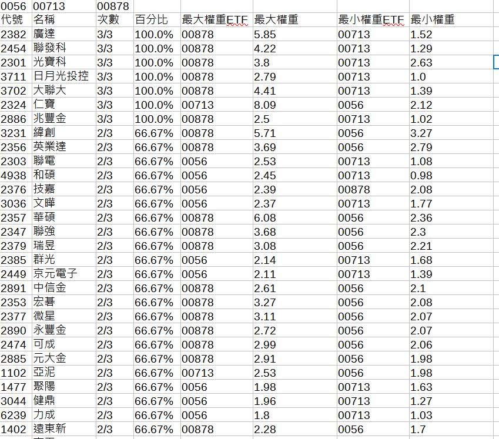

# Taiwan-ETF-Constituent-Statistics
## 這是什麼專案?
這是一個用來統計台灣各家投信所出的國內股票型ETF中成分股的出現次數的專案    
例如現在流行高股息ETF，想知道哪些個股是被多個ETF給納入，就可以使用。  
此專案僅為個人研究用途  

## robots.txt
https://www.moneydj.com/robots.txt

## 需要安裝哪些套件
1.BeautifulSoup4  
2.requests  
3.PySide6  

## 有哪些物件
### 目前專案撰寫了6個物件
1.MainWindow GUI  
2.WorkerThread QThread  
3.ETFLoader 讀取etfissuer資料夾內的csv資料  
4.StockLoader 讀取stock資料夾內的csv資料  
5.ETFRequester 請求各個ETF的成分股資料  
6.CSVWriter 將最終結果輸出成csv檔案

## 之後新出的ETF或新投信沒有怎麼辦?
1.ETF須手動將新的資料加進對應投信的CSV檔案  
2.新投信須手動增加新的CSV檔案  

## 還能如何擴充?
1.加入單一投信的所有ETF  
2.對全部ETF進行統計  
3.針對主題型進行統計，如半導體、高股息...  

# 展示
## 以流行的月月配組合 0056+00878+00713示範

